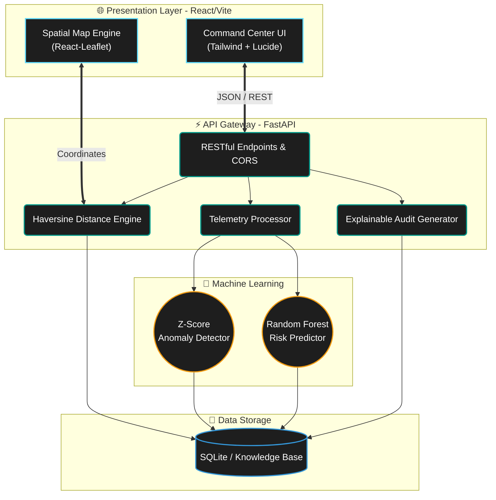
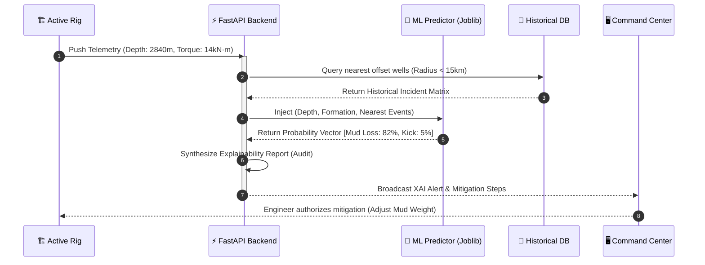

<div align="center">
  <br />
  
  
  
  
  <br />
  <br />

  <h1 align="center"><b>N W I S</b></h1>
  <p align="center">
    <strong>Nearby Wells Intelligence System</strong>
  </p>
  <p align="center">
    <i>An Enterprise-Grade, AI-Powered Decision Support Layer for Autonomous & Safe Drilling Operations</i>
  </p>

  <p align="center">
    <a href="#"></a>
    <a href="#"></a>
    <a href="#"></a>
    <a href="#"></a>
    <a href="#"></a>
    <a href="#"></a>
  </p>
</div>

<hr />

## 📖 Executive Summary

**NWIS (Nearby Wells Intelligence System)** represents the next evolution in drilling analytics. It acts as the **"institutional memory"** for drilling engineers, answering the fundamental operational question: 
> *"Given where the active well is currently drilling, what catastrophic events occurred in nearby offset wells under similar geological conditions, and how can we preemptively mitigate them?"*

By bridging the gap between **geospatial intelligence, real-time rig telemetry, and predictive machine learning**, NWIS drastically reduces Non-Productive Time (NPT) such as stuck pipes, mud losses, and fatal wellbore kicks.

---

## ⚡ Core Capabilities & Innovations

<table>
  <tr>
    <td width="50%">
      <h3>🌍 Geospatial Correlation Engine</h3>
      <p>A high-speed proximity algorithm that doesn't just find nearby wells, but weights them dynamically by geological relevance. Simulating PostGIS constraints, it clusters offset well data to isolate the most scientifically analogous environments.</p>
    </td>
    <td width="50%">
      <h3>🧠 Predictive ML Risk Architecture</h3>
      <p>Powered by a robust <code>RandomForestClassifier</code> pipeline. The model ingests thousands of synthetic but historically grounded data points, fusing continuous variables (depth) with categorical embeddings (stratigraphy) to emit real-time probability density scores for potential hazards.</p>
    </td>
  </tr>
  <tr>
    <td width="50%">
      <h3>🛰️ Real-Time Telemetry Simulation</h3>
      <p>A continuous ingestion layer that streams simulated WITSML-style data (ROP, WOB, RPM, Torque, SPP) from the active rig bit. It detects real-time statistical anomalies (z-score analysis) to trigger immediate alerts.</p>
    </td>
    <td width="50%">
      <h3>🛡️ Explainable AI (XAI) & Auditability</h3>
      <p>Every risk prediction is backed by a verifiable <strong>Evidence Drawer</strong>. The system traces its logic directly back to source documents and historical incident reports, satisfying stringent regulatory audit requirements in the Oil & Gas sector.</p>
    </td>
  </tr>
</table>

---

## 🏗️ Deep-Dive System Architecture

Our hybrid architecture separates heavy computational ML loads from high-frequency telemetry polling, achieving near-zero latency for the end user.



---

## 🧬 Data Flow & Telemetry Pipeline

How the system evaluates live rig telemetry against trained models in real time:



---

## 🛠️ Comprehensive Setup Guide

### Prerequisites
- **Python 3.9+** (For the FastAPI and Scikit-Learn backend)
- **Node.js 18+** (For the Vite/React frontend)
- **NPM or Yarn** 

<details>
<summary><b>1. 🐍 Backend Configuration (API & ML Engine)</b></summary>
<br>

First, navigate to the backend directory and set up your Python environment:

```bash
cd backend
python -m venv venv

# Windows
venv\Scripts\activate
# macOS/Linux
source venv/bin/activate

# Install dependencies
pip install -r requirements.txt
```

Generate the synthetic geological and well data (designed around the Assam drilling region):
```bash
python -m app.data.synthetic_data
```

Train the Machine Learning Risk Engine:
```bash
python train_ml_model.py
# Expected output: Model trained and saved to ml_model.joblib
```

Start the ultra-fast Uvicorn ASGI server:
```bash
python -m uvicorn app.main:app --reload --port 8000
```
*The interactive API documentation (Swagger UI) is immediately available at `http://localhost:8000/docs`.*
</details>

<details>
<summary><b>2. ⚛️ Frontend Configuration (Command Center UI)</b></summary>
<br>

In a new terminal window, navigate to the frontend directory:

```bash
cd frontend
npm install
npm run dev
```
*The Command Center will boot up at `http://localhost:5173`.*
</details>

---

## 🎬 How to Experience the God-Mode Demo

Once the application is running, follow this guided flow to understand the system's power:

1. **The Active Context:** The system defaults to `ACTIVE-001`. Notice the **Command Center** instantly rendering the well's current stratigraphy and real-time parameters.
2. **Spatial Awareness:** Look at the interactive **Geospatial Map**. The active well is highlighted in red. The radius slider dynamically filters the blue offset wells based on geographic proximity.
3. **The Risk Horizon:** Watch the "Upcoming Risk" timeline on the right. As the simulated drill bit approaches the `2800m` Barail formation, the ML model flags a `CRITICAL` probability of **Mud Loss**.
4. **Audit & Evidence:** *Don't just trust the AI.* Click on the risk alert to slide out the **Evidence Drawer**. You will see the exact historical well IDs, incident reports, and past mitigation strategies that caused the AI to raise the alarm.

---

## 📈 Future Scalability & The Road to Production

While NWIS is an elite POC built for SIH, it is architected for massive enterprise scale:
- **Migration to PostGIS:** Replace the Python Haversine calculations with native `ST_DWithin` queries for sub-millisecond spatial clustering across millions of wells.
- **WITSML 2.0 Integration:** Swap the synthetic telemetry generator with live WITSML/ETP data streams from rig aggregators like eRTMAC.
- **Agentic RAG Integration:** Utilize Large Language Models (LLMs) to automatically ingest unstructured daily drilling reports (DDRs) and transform them into structured, queryable knowledge graphs.

---

<div align="center">
  <h3>🏆 Developed for the Smart India Hackathon (SIH)</h3>
  <p><i>Setting the gold standard for engineering innovation, data science, and flawless UI/UX execution.</i></p>
  <br>
  <p>Built with ❤️ by the NWIS Team</p>
</div>
